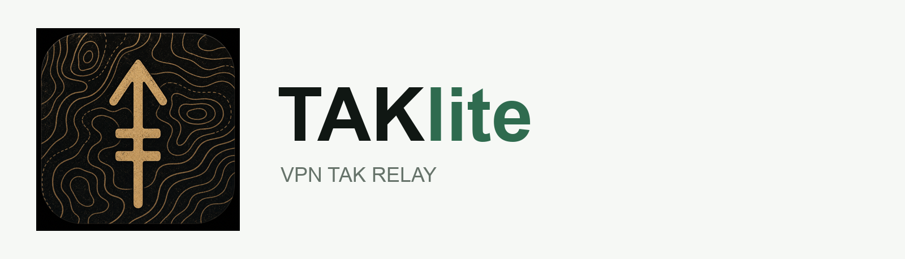
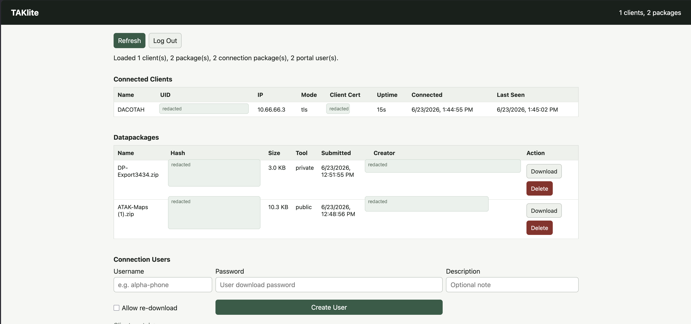

<p align="center">
  
</p>

# TAKlite

TAKlite is a lightweight WireGuard-hosted TAK relay and datapackage service for small ATAK/WinTAK teams.

It can run in two modes:

- Full VPS appliance on supported Debian-based Linux servers: WireGuard, WGDashboard, TAKlite admin dashboard, TLS CoT, plain TCP CoT, datapackage handling, firewall helpers, and a simple user portal for ATAK/WinTAK `.dp.zip` connection bundles.
- Portable Docker mode on Docker Desktop or Docker Engine: TAKlite relay/admin/datapackage services only, for local testing or deployments where VPN/firewall are handled separately.

## What It Does

- Installs WireGuard with an initial admin peer
- Runs WGDashboard over the VPN for peer management
- Runs TAKlite over the VPN for TAK users, clients, and datapackages
- Creates ATAK/WinTAK TLS connection packages
- Provides user/password portal downloads with QR/link support
- Supports bulk Connection User creation for faster onboarding
- Relays PLI, chat, markers, drawings, polygons, and CoT traffic
- Supports datapackage upload, search, download, receive, and delete
- Supports optional authenticator-app 2FA for TAKlite admin login
- Generates fresh keys, tokens, passwords, CA, and certs on every install

## Dashboard Preview



## Requirements

Full VPS appliance:

- Linux VPS or server with `systemd`, TUN, Docker Compose v2, WireGuard tools, `iptables`, and fail2ban
- Automatic dependency install is supported on apt-based hosts such as Ubuntu 22.x+ and Debian 12+
- Raspberry Pi OS 64-bit Bookworm+ for Pi deployments
- Root SSH access for initial setup
- Cloud firewall/security group control
- WireGuard app on the admin computer or phone
- ATAK or WinTAK clients for testing
- Public `51820/udp` open for WireGuard
- Temporary `22/tcp` SSH access during install

Portable Docker mode:

- Docker Desktop on macOS/Windows, or Docker Engine with Compose v2 on Linux
- No WireGuard/WGDashboard/firewall automation from TAKlite
- Existing VPN or local/LAN access if phones need to connect

Do not expose TAKlite, WGDashboard, CoT, or datapackage ports publicly. They are intended to be VPN-only.

## Full VPS Install

SSH into the VPS as `root`, then run:

```bash
cd /root
apt-get update
apt-get install -y git
rm -rf /root/taklite
git clone https://github.com/C137LLC/TAKlite.git /root/taklite
cd /root/taklite
chmod +x install.sh smoke-test.sh
./install.sh
```

The installer prompts for environment-specific values and prints the admin WireGuard profile, WGDashboard login, TAKlite bootstrap token, and certificate password at completion. The ATAK/WinTAK certificate password defaults to `atakatak` unless you change it during install.

Root-only recovery notes are saved on the VPS:

```text
/root/taklite-admin/README.txt
```

## Portable Docker Install

Use this for local testing on macOS, Windows, Linux, or Docker Desktop. It starts TAKlite only. It does not install WireGuard, WGDashboard, fail2ban, systemd services, or firewall rules.

macOS/Linux/WSL/Git Bash:

```bash
git clone https://github.com/C137LLC/TAKlite.git
cd TAKlite
./portable-start.sh
```

Windows PowerShell:

```powershell
git clone https://github.com/C137LLC/TAKlite.git
cd TAKlite
.\portable-start.ps1
```

Docker Desktop GUI:

1. Copy `.env.desktop.example` to `.env`.
2. Leave `WG_BIND_IP=127.0.0.1` for local-only testing, or set `WG_BIND_IP=0.0.0.0` and `TAKLITE_SERVER_HOST=YOUR_COMPUTER_LAN_IP` for phone/LAN testing.
3. Change `TAKLITE_ADMIN_TOKEN`.
4. Run the Compose project in Docker Desktop.

Portable mode auto-generates its local CA, server cert, ATAK truststore, and server truststore when `TAKLITE_AUTO_INIT_CERTS=true`.

## Default VPN Services

After connecting the admin WireGuard profile:

```text
WGDashboard: http://10.66.66.1:10086
TAKlite:     http://10.66.66.1:8080/
Portal:      http://10.66.66.1:8080/connect/
TLS CoT:     10.66.66.1:8089
Plain CoT:   10.66.66.1:58087
```

## Basic Workflow

1. Run `./install.sh` on the VPS.
2. Copy the generated admin WireGuard config back to your local machine.
3. Import the admin WireGuard config and connect VPN.
4. Open WGDashboard and TAKlite over the VPN.
5. Create the first TAKlite admin account with the bootstrap token.
6. Use WGDashboard to create device VPN peers.
7. Use TAKlite Connection Users to create ATAK/WinTAK `.dp.zip` bundles, either one at a time or with Create Bulk Users.
8. Give users WireGuard QR plus TAKlite portal QR/link and password.
9. Test PLI, chat, marker drops, and datapackages.

Admin config retrieval examples:

```bash
scp root@YOUR_VPS_PUBLIC_IP:/root/taklite-admin/admin-wg0.conf .
rsync -av root@YOUR_VPS_PUBLIC_IP:/root/taklite-admin/admin-wg0.conf .
```

## Update Existing Server

Do not rerun `install.sh` for normal updates. Use one of the two workflows below so TAKlite keeps existing WireGuard peers, TAKlite users, certs, datapackages, generated packages, database state, and `.env` settings.

Updates preserve custom network settings and ports, including changed TAKlite HTTP/HTTPS/CoT ports, WireGuard bind IP, and WGDashboard URL.

The Settings page also includes a GUI update button. GUI updates only run when the GitHub release exposes a TAKlite release zip with a SHA-256 digest, then the host runner checks that hash before applying the update.

### Option 1: Update From GitHub

Run this on the VPS:

```bash
set -Eeuo pipefail

if ! command -v git >/dev/null 2>&1; then
  apt-get update
  apt-get install -y git
fi

if [ -f /root/taklite/docker-compose.yml ]; then
  APP_DIR=/root/taklite
elif [ -f /root/TAKlite/docker-compose.yml ]; then
  APP_DIR=/root/TAKlite
elif [ -f /root/taklite-vps-bundle/docker-compose.yml ]; then
  APP_DIR=/root/taklite-vps-bundle
else
  echo "Could not find TAKlite app directory" >&2
  exit 1
fi

STAGE=/root/TAKlite-update
rm -rf "$STAGE"
git clone --depth 1 https://github.com/C137LLC/TAKlite.git "$STAGE"

bash "$STAGE/update.sh" --from-dir "$STAGE" --app-dir "$APP_DIR"
```

### Option 2: Update From Release Zip

From your admin computer, upload the release zip:

```bash
scp TAKlite-vX.Y.Z.zip root@10.66.66.1:/root/
```

Then run this on the VPS:

```bash
set -Eeuo pipefail

if [ -f /root/taklite/docker-compose.yml ]; then
  APP_DIR=/root/taklite
elif [ -f /root/TAKlite/docker-compose.yml ]; then
  APP_DIR=/root/TAKlite
elif [ -f /root/taklite-vps-bundle/docker-compose.yml ]; then
  APP_DIR=/root/taklite-vps-bundle
else
  echo "Could not find TAKlite app directory" >&2
  exit 1
fi

bash "$APP_DIR/update.sh" /root/TAKlite-vX.Y.Z.zip
```

Never clone or unzip directly over the live TAKlite app directory. Stage the new release first, then let `update.sh` preserve the live server state.

## Uninstall Or Reinstall

Use these only when you intentionally want to wipe the TAKlite deployment. Normal upgrades should use `update.sh`.

Warning: uninstall and reinstall stop WireGuard. If you are SSH'd into the VPS through the WireGuard tunnel, your shell can disconnect before the command finishes. Make sure public SSH/22 is open from a network you can reach, or have VPS console access ready before running these.

Uninstall wipes TAKlite, WGDashboard, WireGuard config, admin recovery files, certs, users, datapackages, generated packages, and TAKlite backups:

```bash
cd /root
rm -rf /root/TAKlite-update
git clone --depth 1 https://github.com/C137LLC/TAKlite.git /root/TAKlite-update

bash /root/TAKlite-update/uninstall.sh --yes
```

Reinstall wipes the current deployment, recreates the app directory, and runs a fresh install with new WireGuard and TAKlite identity:

```bash
cd /root
rm -rf /root/TAKlite-update
git clone --depth 1 https://github.com/C137LLC/TAKlite.git /root/TAKlite-update

bash /root/TAKlite-update/reinstall.sh --yes
```

## Security Notes

Every clean install generates new:

- WireGuard server and admin peer keys
- WGDashboard password
- TAKlite bootstrap token
- Local CA and server certificate
- ATAK/WinTAK client certificates

The TAKlite certificate password defaults to `atakatak` for easier ATAK/WinTAK imports unless changed during install.

Do not reuse `/root/taklite-admin`, `/etc/wireguard`, `.env`, `taklite/certs`, or `taklite/data` between VPS deployments.

Optional admin 2FA can be enabled from Settings after the first admin account is created. The installer also configures fail2ban for SSH and TAKlite admin, portal, and bootstrap authentication failures.

## Documentation

- [User Guide](docs/user-guide.md)
- [User Guide PDF](docs/TAKlite-User-Guide.pdf)
- [Admin Install Guide](docs/admin-install-guide.md)
- [Access Control Guide](docs/access-control-guide.md)
- [Access Control Guide PDF](docs/TAKlite-Access-Control-Guide.pdf)
- [Deployment And Update Lifecycle](docs/deployment-lifecycle.md)
- [Backup And Restore](docs/backup-restore.md)
- [Dependency Update Checklist](docs/dependency-update-checklist.md)
- [Platform Support](docs/platform-support.md)
- [Upgrade Guide](docs/upgrade-guide.md)
- [Test Checklist](docs/test-checklist.md)
- [Audit Notes](docs/audit-notes.md)
